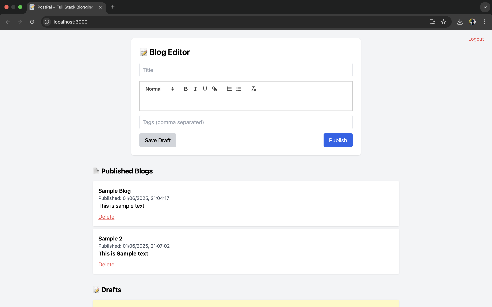
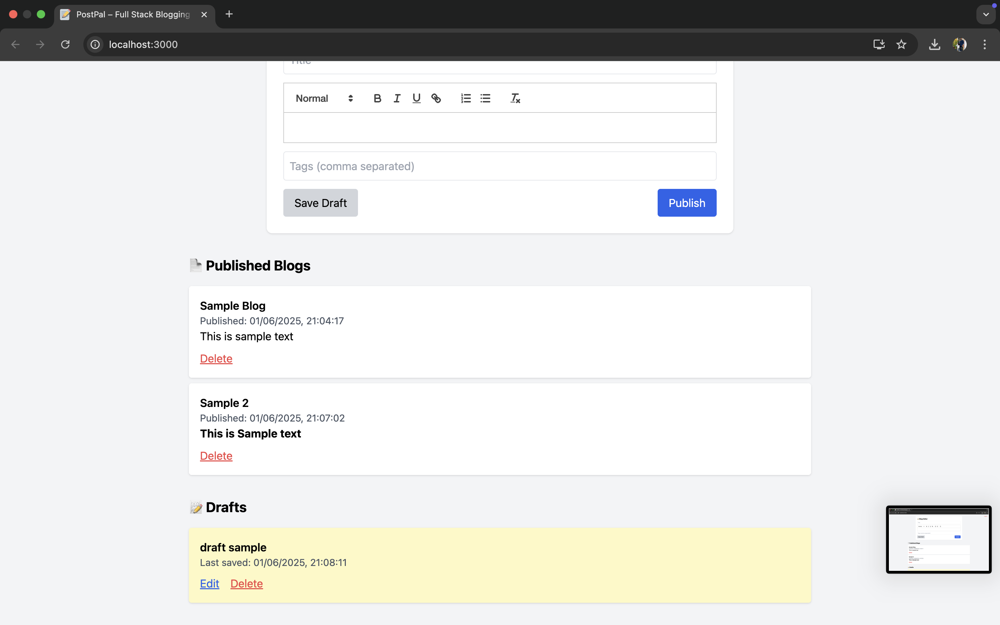

# 📝 PostPal – Full Stack Blogging Platform

A full-stack blog editor where users can write, auto-save drafts, and publish posts.

## 🚀 Features

- ✍️ Blog Editor with Title, Rich Content, and Tags
- 💾 Auto-save Drafts (after 5s of inactivity)
- 📤 Manual Save & Publish options
- 📜 Display of Published & Draft Blogs
- 🔐 JWT Authentication (Signup, Login, Logout)
- 🧑‍💻 Multi-user support with isolation
- 🗑️ Delete Drafts or Published posts
- ⚙️ Backend: Node.js + Express + MongoDB
- 🌐 Frontend: React + Tailwind CSS + React-Quill

## 📷 Screenshots

### Blog Editor

### Published & Draft Blogs

## 📦 Tech Stack

- Frontend: React, Tailwind CSS, React-Quill
- Backend: Node.js, Express.js, MongoDB, Mongoose
- Auth: JWT (Token-based)

## 🔧 Setup Instructions

### Prerequisites
- Node.js
- MongoDB

### Backend
cd blog-backend

npm install

npm start

### .env file
MONGO_URI=mongodb://localhost:27017/blogdb

SECRET= JWTSECRET

### Frontend
cd blog-frontend

npm install

npm start

### Sample User
Signup with any email/password — each user sees only their own blogs.